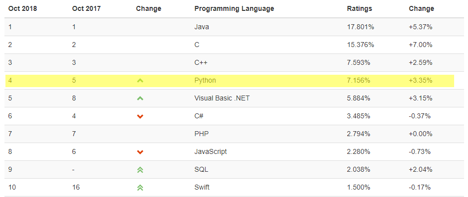
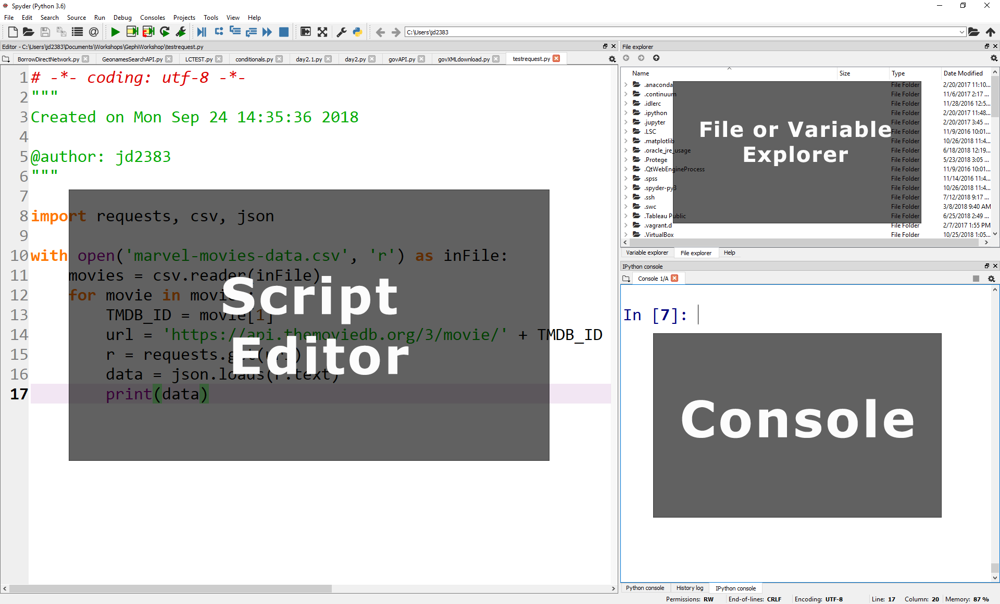

# Python Part One: An Introduction

This workshop is licensed under a [Creative Commons Attribution 4.0 International License](https://creativecommons.org/licenses/by/4.0/).  

[Source](https://git.yale.edu/yul-dss/FirstStepsPython)

For this workshop, I recommend installing Python 3 using [Anaconda](https://www.anaconda.com/distribution/#download-section). The workshop was built using the Spyder IDE, but users can use any python environment they prefer.

## What is Python?
* General programming language
*  Open and free environment
  * Lots of community support
  
## Why use Python?
General programming language...good at most tasks

* It's **free**
* Python vs R
  * Data Analysis...R
  * Wide range of tasks...python
* Common Uses
  * Web Scraping (Text & Data Mining)
  * Web Applications
  * Repetitive tasks & task automation
  * Transforming & Manipulating data
  * Row by Row

## Python Setup
### Installing Python
  * Download & install manually
    * Usually through command line (shell)
  * Part of IDE or package
    * Anaconda
    * Spyder
### How to write & run python files (.py)
  * Text files (.py) & command line
  * iPython notebooks (jupyter)
  * IDE (Spyder, IDLE, etc)

## Spyder Interface

We are using Spyder for this workshop. Here's how to get started with Spyder:

*  Download and install Anconda (Python 3.7) [https://www.anaconda.com/download/](https://www.anaconda.com/download/)
*  Once installed, open Spyder!

### Screenshot of default Spyder layout

## Variables & Data Types
### Use variables to store values.

*   Variables are names for values.
*   In Python the `=` symbol assigns the value on the right to the name on the left.
*   The variable is created when a value is assigned to it.
*   Here, Python assigns an age to a variable `age`
    and a name in quotes to a variable `first_name`.

~~~python
age = 42
first_name = 'Ahmed'
~~~

*   Variable names
    * can **only** contain letters, digits, and underscore `_` (typically used to separate words in long variable names)
    * cannot start with a digit
*   Variable names that start with underscores like `__alistairs_real_age` have a special meaning
    so we won't do that until we understand the convention.

### Use `print` to display values.

*   Python has a built-in function called `print` that prints things as text.
*   Call the function (i.e., tell Python to run it) by using its name.
*   Provide values to the function (i.e., the things to print) in parentheses.
*   To add a string to the printout, wrap the string in single or double quotes.
*   The values passed to the function are called 'arguments'

~~~python
print(first_name, 'is', age, 'years old')
~~~

~~~
Ahmed is 42 years old
~~~

*   `print` automatically puts a single space between items to separate them.
*   And wraps around to a new line at the end.

### Variables must be created before they are used.

*   If a variable doesn't exist yet, or if the name has been mis-spelled,
    Python reports an error.
    *   Unlike some languages, which "guess" a default value.

~~~python
print(last_name)
~~~

~~~
---------------------------------------------------------------------------
NameError                                 Traceback (most recent call last)
<ipython-input-1-c1fbb4e96102> in <module>()
----> 1 print(last_name)

NameError: name 'last_name' is not defined
~~~
### Variables can be used in calculations.

*   We can use variables in calculations just as if they were values.
    *   Remember, we assigned 42 to `age` a few lines ago.

~~~python
age = age + 3
print('Age in three years:', age)
~~~

~~~
Age in three years: 45
~~~

### Every value has a type.

*   Every value in a program has a specific type.
*   Integer (`int`): represents positive or negative whole numbers like 3 or -512.
*   Floating point number (`float`): represents real numbers like 3.14159 or -2.5.
*   Character string (usually called "string", `str`): text.
    *   Written in either single quotes or double quotes (as long as they match).
    *   The quote marks aren't printed when the string is displayed.

### Use the built-in function `type` to find the type of a value.

*   Use the built-in function `type` to find out what type a value has.
*   Works on variables as well.
    *   But remember: the *value* has the type --- the *variable* is just a label.

~~~python
print(type(52))
~~~

~~~
<class 'int'>
~~~

~~~python
fitness = 'average'
print(type(fitness))
~~~

~~~
<class 'str'>
~~~

### Types control what operations (or methods) can be performed on a given value.

*   A value's type determines what the program can do to it.

~~~python
print(5 - 3)
~~~

~~~
2
~~~

~~~python
print('hello' - 'h')
~~~

~~~
---------------------------------------------------------------------------
TypeError                                 Traceback (most recent call last)
<ipython-input-2-67f5626a1e07> in <module>()
----> 1 print('hello' - 'h')

TypeError: unsupported operand type(s) for -: 'str' and 'str'
~~~

### You can use the "+" and "*" operators on strings.

*   "Adding" character strings concatenates them.

~~~python
full_name = 'Ahmed' + ' ' + 'Walsh'
print(full_name)
~~~

~~~
Ahmed Walsh
~~~

*   Multiplying a character string by an integer _N_ creates a new string that consists of that character string repeated  _N_ times.
    *   Since multiplication is repeated addition.

~~~python
separator = '=' * 10
print(separator)
~~~

~~~
==========
~~~

### Strings have a length (but numbers don't).

*   The built-in function `len` counts the number of characters in a string.

~~~python
print(len(full_name))
~~~

~~~
11
~~~

*   But numbers don't have a length (not even zero).

~~~python
print(len(52))
~~~

~~~
---------------------------------------------------------------------------
TypeError                                 Traceback (most recent call last)
<ipython-input-3-f769e8e8097d> in <module>()
----> 1 print(len(52))

TypeError: object of type 'int' has no len()
~~~

### Must convert numbers to strings or vice versa when operating on them.

*   Cannot add numbers and strings.

~~~python
print(1 + '2')
~~~

~~~
---------------------------------------------------------------------------
TypeError                                 Traceback (most recent call last)
<ipython-input-4-fe4f54a023c6> in <module>()
----> 1 print(1 + '2')

TypeError: unsupported operand type(s) for +: 'int' and 'str'
~~~

*   Not allowed because it's ambiguous: should `1 + '2'` be `3` or `'12'`?
*   Some types can be converted to other types by using the type name as a function.

~~~python
print(1 + int('2'))
print(str(1) + '2')
~~~

~~~
3
12
~~~

### Can mix integers and floats freely in operations.

*   Integers and floating-point numbers can be mixed in arithmetic.
    *   Python 3 automatically converts integers to floats as needed. (Integer division in Python 2 will return an integer, the *floor* of the division.)

~~~python
print('half is', 1 / 2.0)
print('three squared is', 3.0 ** 2)
~~~

~~~
half is 0.5
three squared is 9.0
~~~

### Variables only change value when something is assigned to them.

*   If we make one cell in a spreadsheet depend on another,
    and update the latter,
    the former updates automatically.
*   This does **not** happen in programming languages.

~~~python
first = 1
second = 5 * first
first = 2
print('first is', first, 'and second is', second)
~~~

~~~
first is 2 and second is 5
~~~

*   The computer reads the value of `first` when doing the multiplication,
    creates a new value, and assigns it to `second`.
*   After that, `second` does not remember where it came from.

## Built-In Functions & Libraries
### Use comments to add documentation to programs.

~~~python
# This sentence isn't executed by Python.
adjustment = 0.5   # Neither is this - anything after '#' is ignored.
~~~

### A function may take zero or more arguments.

*   We have seen some functions already --- now let's take a closer look.
*   An *argument* is a value passed into a function.
*   `len` takes exactly one.
*   `int`, `str`, and `float` create a new value from an existing one.
*   `print` takes zero or more.
*   `print` with no arguments prints a blank line.
    *   Must always use parentheses, even if they're empty,
        so that Python knows a function is being called.

~~~python
print('before')
print()
print('after')
~~~

~~~
before

after
~~~

### Commonly-used built-in functions include `max`, `min`, and `round`.

*   Use `max` to find the largest value of one or more values.
*   Use `min` to find the smallest.
*   Both work on character strings as well as numbers.
    *   "Larger" and "smaller" use (0-9, A-Z, a-z) to compare letters.

~~~python
print(max(1, 2, 3))
print(min('a', 'A', '0'))
~~~

~~~
3
0
~~~

### Functions may only work for certain (combinations of) arguments.

*   `max` and `min` must be given at least one argument.
    *   "Largest of the empty set" is a meaningless question.
*   And they must be given things that can meaningfully be compared.

~~~python
print(max(1, 'a'))
~~~

~~~
TypeError: unorderable types: str() > int()
~~~

### Functions may have default values for some arguments.

*   `round` will round off a floating-point number.
*   By default, rounds to zero decimal places.

~~~python
round(3.712)
~~~

~~~
4
~~~

*   We can specify the number of decimal places we want.

~~~python
round(3.712, 1)
~~~

~~~
3.7
~~~

### Use the built-in function `help` to get help for a function.

*   Every built-in function has online documentation.

~~~python
help(round)
~~~

~~~
Help on built-in function round in module builtins:

round(...)
    round(number[, ndigits]) -> number

    Round a number to a given precision in decimal digits (default 0 digits).
    This returns an int when called with one argument, otherwise the
    same type as the number. ndigits may be negative.
~~~

### Most of the power of a programming language is in its libraries.

*   A *library* is a collection of files (called *modules*) that contains
    functions for use by other programs.
    *   May also contain data values (e.g., numerical constants) and other things.
    *   Library's contents are supposed to be related, but there's no way to enforce that.
*   The Python [standard library](https://docs.python.org/3/library/) is an extensive suite of modules that comes
    with Python itself.
*   Many additional libraries are available from [PyPI][pypi] (the Python Package Index).
*   We will see later how to write new libraries.

### A program must import a library module before using it.

*   Use `import` to load a library module into a program's memory.
*   Then refer to things from the module as `module_name.thing_name`.
    *   Python uses `.` to mean "part of".
*   Using `math`, one of the modules in the standard library:

~~~python
import math

print('pi is', math.pi)
print('cos(pi) is', math.cos(math.pi))
~~~

~~~
pi is 3.141592653589793
cos(pi) is -1.0
~~~

*   Have to refer to each item with the module's name.
    *   `math.cos(pi)` won't work: the reference to `pi`
        doesn't somehow "inherit" the function's reference to `math`.

### Use `help` to learn about the contents of a library module.

*   Works just like help for a function.

~~~python
help(math)
~~~

~~~
Help on module math:

NAME
    math

MODULE REFERENCE
    http://docs.python.org/3.5/library/math

    The following documentation is automatically generated from the Python
    source files.  It may be incomplete, incorrect or include features that
    are considered implementation detail and may vary between Python
    implementations.  When in doubt, consult the module reference at the
    location listed above.

DESCRIPTION
    This module is always available.  It provides access to the
    mathematical functions defined by the C standard.

FUNCTIONS
    acos(...)
        acos(x)

        Return the arc cosine (measured in radians) of x.
⋮ ⋮ ⋮
~~~

### Import specific items from a library module to shorten programs.

*   Use `from ... import ...` to load only specific items from a library module.
*   Then refer to them directly without library name as prefix.

~~~python
from math import cos, pi

print('cos(pi) is', cos(pi))
~~~

~~~
cos(pi) is -1.0
~~~

### Create an alias for a library module when importing it to shorten programs.

*   Use `import ... as ...` to give a library a short *alias* while importing it.
*   Then refer to items in the library using that shortened name.

~~~python
import math as m

print('cos(pi) is', m.cos(m.pi))
~~~

~~~
cos(pi) is -1.0
~~~

*   Commonly used for libraries that are frequently used or have long names.
    *   E.g., `matplotlib` plotting library is often aliased as `mpl`.
*   But can make programs harder to understand,
    since readers must learn your program's aliases.
    
## Lists
### A list stores many values in a single structure.

*   Doing calculations with a hundred variables called `pressure_001`, `pressure_002`, etc.,
    would be at least as slow as doing them by hand.
*   Use a *list* to store many values together.
    *   Contained within square brackets `[...]`.
    *   Values separated by commas `,`.
*   Use `len` to find out how many values are in a list.

~~~python
pressures = [0.273, 0.275, 0.277, 0.275, 0.276]
print('pressures:', pressures)
print('length:', len(pressures))
~~~

~~~
pressures: [0.273, 0.275, 0.277, 0.275, 0.276]
length: 5
~~~

### Use an item's index to fetch it from a list.

*   Just like strings.

~~~python
print('zeroth item of pressures:', pressures[0])
print('fourth item of pressures:', pressures[4])
~~~

~~~
zeroth item of pressures: 0.273
fourth item of pressures: 0.276
~~~

### Lists' values can be replaced by assigning to them.

*   Use an index expression on the left of assignment to replace a value.

~~~python
pressures[0] = 0.265
print('pressures is now:', pressures)
~~~

~~~
pressures is now: [0.265, 0.275, 0.277, 0.275, 0.276]
~~~

### Appending items to a list lengthens it.

*   Use `list_name.append` to add items to the end of a list.

~~~python
primes = [2, 3, 5]
print('primes is initially:', primes)
primes.append(7)
primes.append(9)
print('primes has become:', primes)
~~~

~~~
primes is initially: [2, 3, 5]
primes has become: [2, 3, 5, 7, 9]
~~~

*   `append` is a *method* of lists.
    *   Like a function, but tied to a particular object.
*   Use `object_name.method_name` to call methods.
    *   Deliberately resembles the way we refer to things in a library.
*   We will meet other methods of lists as we go along.
    *   Use `help(list)` for a preview.
*   `extend` is similar to `append`, but it allows you to combine two lists.  For example:

~~~python
teen_primes = [11, 13, 17, 19]
middle_aged_primes = [37, 41, 43, 47]
print('primes is currently:', primes)
primes.extend(teen_primes)
print('primes has now become:', primes)
primes.append(middle_aged_primes)
print('primes has finally become:', primes)
~~~

~~~
primes is currently: [2, 3, 5, 7, 9]
primes has now become: [2, 3, 5, 7, 9, 11, 13, 17, 19]
primes has finally become: [2, 3, 5, 7, 9, 11, 13, 17, 19, [37, 41, 43, 47]]
~~~

Note that while `extend` maintains the "flat" structure of the list, appending a list to a list makes the result two-dimensional.

### Use `del` to remove items from a list entirely.

*   `del list_name[index]` removes an item from a list and shortens the list.
*   Not a function or a method, but a statement in the language.

~~~python
print('primes before removing last item:', primes)
del primes[4]
print('primes after removing last item:', primes)
~~~

~~~
primes before removing last item: [2, 3, 5, 7, 9]
primes after removing last item: [2, 3, 5, 7]
~~~

### The empty list contains no values.

*   Use `[]` on its own to represent a list that doesn't contain any values.
    *   "The zero of lists."
*   Helpful as a starting point for collecting values
    (which we will see in the [next episode]({{page.root}}/09-for-loops/)).

### Lists may contain values of different types.

*   A single list may contain numbers, strings, and anything else.

~~~python
goals = [1, 'Create lists.', 2, 'Extract items from lists.', 3, 'Modify lists.']
~~~

### Character strings can be indexed like lists.

*   Get single characters from a character string using indexes in square brackets.

~~~python
element = 'carbon'
print('zeroth character:', element[0])
print('third character:', element[3])
~~~

~~~
zeroth character: c
third character: b
~~~

### Character strings are immutable.

*   Cannot change the characters in a string after it has been created.
    *   *Immutable*: can't be changed after creation.
    *   In contrast, lists are *mutable*: they can be modified in place.
*   Python considers the string to be a single value with parts,
    not a collection of values.

~~~python
element[0] = 'C'
~~~

~~~
TypeError: 'str' object does not support item assignment
~~~

*   Lists and character strings are both *collections*.

### Indexing beyond the end of the collection is an error.

*   Python reports an `IndexError` if we attempt to access a value that doesn't exist.
    *   This is a kind of [runtime error]({{ page.root }}/05-error-messages/).
    *   Cannot be detected as the code is parsed
        because the index might be calculated based on data.

~~~python
print('99th element of element is:', element[99])
~~~
## Loops

### A *for loop* executes commands once for each value in a collection.

*   Doing calculations on the values in a list one by one
    is as painful as working with `pressure_001`, `pressure_002`, etc.
*   A *for loop* tells Python to execute some statements once for each value in a list,
    a character string,
    or some other collection.
*   "for each thing in this group, do these operations"

~~~python
for number in [2, 3, 5]:
    print(number)
~~~

*   This `for` loop is equivalent to:

~~~python
print(2)
print(3)
print(5)
~~~

*   And the `for` loop's output is:

~~~
2
3
5
~~~

### The first line of the `for` loop must end with a colon, and the body must be indented.

*   The colon at the end of the first line signals the start of a *block* of statements.
*   Python uses indentation rather than `{}` or `begin`/`end` to show *nesting*.
    *   Any consistent indentation is legal, but almost everyone uses four spaces.

~~~python
for number in [2, 3, 5]:
print(number)
~~~

~~~
IndentationError: expected an indented block
~~~

*   Indentation is always meaningful in Python.

~~~python
firstName="Jon"
  lastName="Smith"
~~~

~~~
  File "<ipython-input-7-f65f2962bf9c>", line 2
    lastName="Smith"
    ^
IndentationError: unexpected indent
~~~

*   This error can be fixed by removing the extra spaces
    at the beginning of the second line.

### A `for` loop is made up of a collection, a loop variable, and a body.

~~~python
for number in [2, 3, 5]:
    print(number)
~~~

*   The collection, `[2, 3, 5]`, is what the loop is being run on.
*   The body, `print(number)`, specifies what to do for each value in the collection.
*   The loop variable, `number`, is what changes for each *iteration* of the loop.
    *   The "current thing".

### Loop variables can be called anything.

*   As with all variables, loop variables are:
    *   Created on demand.
    *   Meaningless: their names can be anything at all.

~~~python
for kitten in [2, 3, 5]:
    print(kitten)
~~~

### The body of a loop can contain many statements.

*   But no loop should be more than a few lines long.
*   Hard for human beings to keep larger chunks of code in mind.

~~~python
primes = [2, 3, 5]
for p in primes:
    squared = p ** 2
    cubed = p ** 3
    print(p, squared, cubed)
~~~

~~~
2 4 8
3 9 27
5 25 125
~~~

### Use `range` to iterate over a sequence of numbers.

*   The built-in function `range` produces a sequence of numbers.
    *   *Not* a list: the numbers are produced on demand
        to make looping over large ranges more efficient.
*   `range(N)` is the numbers 0..N-1
    *   Exactly the legal indices of a list or character string of length N

~~~python
print('a range is not a list: range(0, 3)')
for number in range(0,3):
    print(number)
~~~

~~~
a range is not a list: range(0, 3)
0
1
2
~~~

### The Accumulator pattern turns many values into one.

*   A common pattern in programs is to:
    1.  Initialize an *accumulator* variable to zero, the empty string, or the empty list.
    2.  Update the variable with values from a collection.

~~~python
# Sum the first 10 integers.
total = 0
for number in range(10):
   total = total + (number + 1)
print(total)
~~~

~~~
55
~~~

*   Read `total = total + (number + 1)` as:
    *   Add 1 to the current value of the loop variable `number`.
    *   Add that to the current value of the accumulator variable `total`.
    *   Assign that to `total`, replacing the current value.
*   We have to add `number + 1` because `range` produces 0..9, not 1..10.

## Conditionals

### Use `if` statements to control whether or not a block of code is executed.

*   An `if` statement (more properly called a *conditional* statement)
    controls whether some block of code is executed or not.
*   Structure is similar to a `for` statement:
    *   First line opens with `if` and ends with a colon
    *   Body containing one or more statements is indented (usually by 4 spaces)

~~~python
mass = 3.54
if mass > 3.0:
    print(mass, 'is large')

mass = 2.07
if mass > 3.0:
    print (mass, 'is large')
~~~

~~~
3.54 is large
~~~

### Conditionals are often used inside loops.

*   Not much point using a conditional when we know the value (as above).
*   But useful when we have a collection to process.

~~~python
masses = [3.54, 2.07, 9.22, 1.86, 1.71]
for m in masses:
    if m > 3.0:
        print(m, 'is large')
~~~

~~~
3.54 is large
9.22 is large
~~~

### Use `else` to execute a block of code when an `if` condition is *not* true.

*   `else` can be used following an `if`.
*   Allows us to specify an alternative to execute when the `if` *branch* isn't taken.

~~~python
masses = [3.54, 2.07, 9.22, 1.86, 1.71]
for m in masses:
    if m > 3.0:
        print(m, 'is large')
    else:
        print(m, 'is small')
~~~

~~~
3.54 is large
2.07 is small
9.22 is large
1.86 is small
1.71 is small
~~~

### Use `elif` to specify additional tests.

*   May want to provide several alternative choices, each with its own test.
*   Use `elif` (short for "else if") and a condition to specify these.
*   Always associated with an `if`.
*   Must come before the `else` (which is the "catch all").

~~~python
masses = [3.54, 2.07, 9.22, 1.86, 1.71]
for m in masses:
    if m > 9.0:
        print(m, 'is HUGE')
    elif m > 3.0:
        print(m, 'is large')
    else:
        print(m, 'is small')
~~~

~~~
3.54 is large
2.07 is small
9.22 is HUGE
1.86 is small
1.71 is small
~~~

### Conditions are tested once, in order.

*   Python steps through the branches of the conditional in order, testing each in turn.
*   So ordering matters.

~~~python
grade = 85
if grade >= 70:
    print('grade is C')
elif grade >= 80:
    print('grade is B')
elif grade >= 90:
    print('grade is A')
~~~

~~~
grade is C
~~~

*   Does *not* automatically go back and re-evaluate if values change.

~~~python
velocity = 10.0
if velocity > 20.0:
    print('moving too fast')
else:
    print('adjusting velocity')
    velocity = 50.0
~~~

~~~
adjusting velocity
~~~

*   Often use conditionals in a loop to "evolve" the values of variables.

~~~python
velocity = 10.0
for i in range(5): # execute the loop 5 times
    print(i, ':', velocity)
    if velocity > 20.0:
        print('moving too fast')
        velocity = velocity - 5.0
    else:
        print('moving too slow')
        velocity = velocity + 10.0
print('final velocity:', velocity)
~~~

~~~python
0 : 10.0
moving too slow
1 : 20.0
moving too slow
2 : 30.0
moving too fast
3 : 25.0
moving too fast
4 : 20.0
moving too slow
final velocity: 30.0
~~~

Workshop materials are drevied from work that is Copyright ©[Software Carpentry](http://software-carpentry.org/).